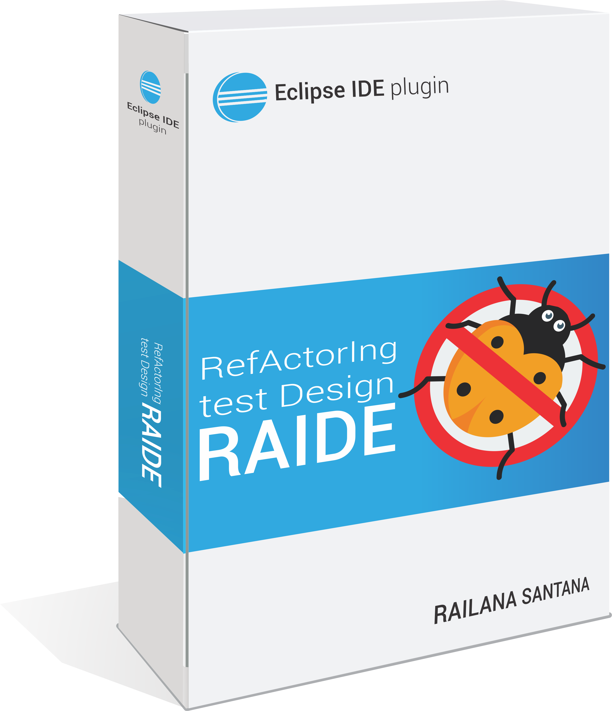

# RefActorIng test Design Errors (RAIDE)

The RAIDE Plugin is a tool for analyzing test smells and is a pioneer in automated refactoring of test smells for Java projects with JUnit. The first version of the tool supports the test smells Assertion Roulette and Duplicate Assert. 

> We reuse [JDeodorant](https://github.com/tsantalis/JDeodorant) graphics components and [tsDetect](https://github.com/TestSmells) detection rules.
